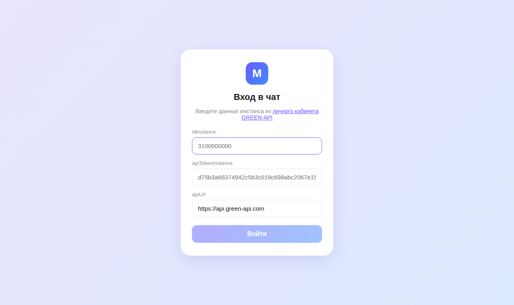
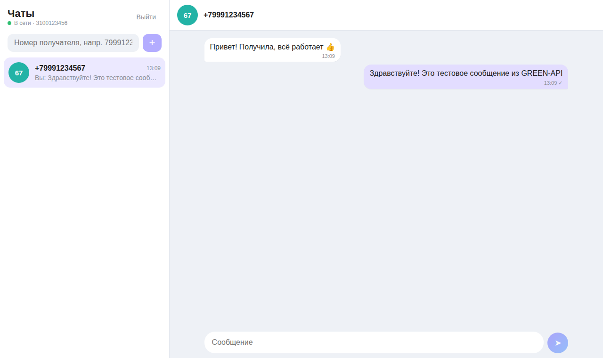
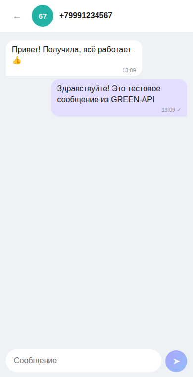

# MAX Chat (GREEN-API)

Тестовое задание на позицию фронтенд-разработчика (React).

Веб-интерфейс для отправки и получения текстовых сообщений в MAX через [GREEN-API](https://green-api.com/max). Дизайн примерно как у web.max.ru.

Что умеет:

- вход по `idInstance` / `apiTokenInstance` / `apiUrl` (проверяется через `getStateInstance`)
- создание чата по номеру телефона
- отправка сообщений ([SendMessage](https://green-api.com/v3/docs/api/sending/SendMessage/))
- получение сообщений через [HTTP API](https://green-api.com/v3/docs/api/receiving/technology-http-api/) (`ReceiveNotification` + `DeleteNotification`)
- если пишет новый контакт, чат появляется сам
- чаты и логин сохраняются в localStorage
- работает на мобильных

Стек: React 19, TypeScript, Vite, Vitest. Состояние на `useReducer`, без сторонних библиотек.

## Запуск

Нужен Node.js 20+.

```bash
npm install
npm run dev
```

Тесты: `npm test`, сборка: `npm run build`.

Деплой на GitHub Pages делается через `.github/workflows/deploy.yml` при пуше в `main` (в настройках репозитория Pages → Source: GitHub Actions).

## Настройка инстанса

1. Создать инстанс MAX в [console.green-api.com](https://console.green-api.com) и авторизовать его.
2. В настройках инстанса оставить `webhookUrl` пустым, иначе уведомления не попадут в очередь HTTP API. Включить входящие сообщения и, по возможности, исходящие.
3. Ввести данные инстанса на странице входа.

Номер получателя вводится в формате `79991234567`.

## Заметки

- В MAX ответ иногда приходит с числовым `chatId`, а не с `номер@c.us`, на который отправляли. Поэтому чат ищется ещё по номеру отправителя и по `idMessage`, а найденный id запоминается (`aliases` в редьюсере).
- Своё сообщение показывается сразу, потом получает `idMessage`. Эхо `outgoingAPIMessageReceived` с тем же id не дублируется.
- `DeleteNotification` вызывается в `finally`, чтобы очередь не застревала.
- Поддерживаются только `textMessage` и `extendedTextMessage`.

Токен хранится только в localStorage браузера, «Выйти» его удаляет.

## Скриншоты

| Вход | Чат | Мобильная версия |
|---|---|---|
|  |  |  |
